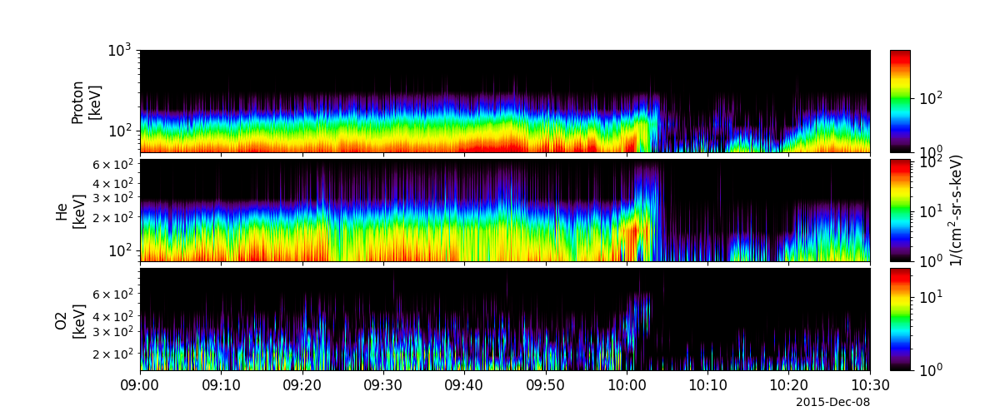
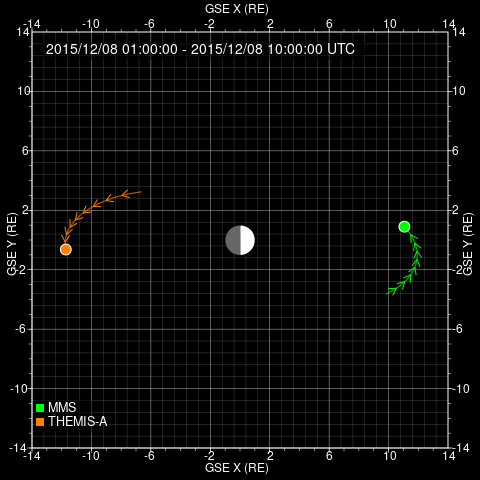
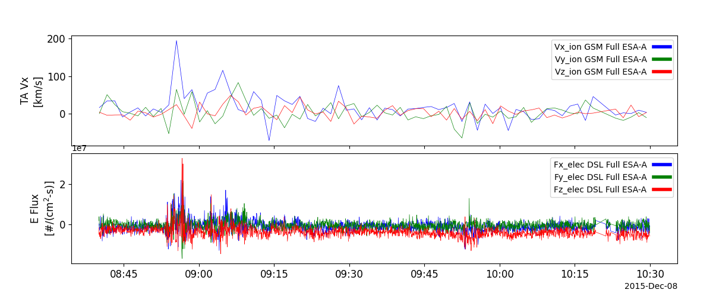
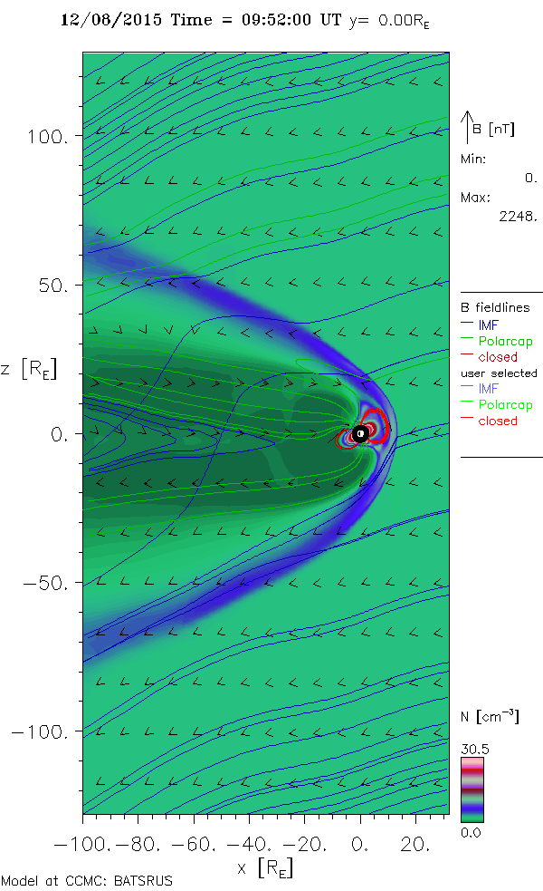

# Spedas
 
 
## Abstract
On December 8, 2015 at 1000 UT, the Energetic Particle Detector (EPD) $-$ Energetic Ion Spectrometer (EIS) aboard the Magnetospheric Multiscale Spacecrafts (MMS) observed a burst of energetic particles from lowest energy to highest energy in the magneto sheath $(11.1, 0.6, -1.2)_{GSM}$. At 0845 the Themis-A (located in the nightside of the earth in the magnetotail) spacecraft measured a spike in the velocities and kinetic energies of particles indicating a substorm injection of particles. 
The drift time of these particles to reach the MMS spacecraft is 44 minutes for 70 keV protons with a $90 \deg$ pitch angle (Lee et al., 2016) which indicates that the source of the particles measured by the EPD were probably from this event and not from solar wind. 
There are two proposed mechanisms that may have caused this event: gyroradius or solar wind dynamic pressure. 
However, in order to observe the proton, helium \& oxygen dispersion simultaneously, it would require energy differences much greater then what was observed. 
Thus the remaining driving mechanism is solar wind dynamic pressure. 
During this event, the solar went radially toward the earth which has been shown to cause magnetopause movement (Sibeck et al., 1989). 
By estimating the increase in the magnetic strength due to magnetopause compression, the resulting increase in kinetic energy due to conservation of the first adiabatic invariant is 2.4x over the time period. 
This phenomena is supported by the data (energy increase) \& pressure.  

[
Figure 1. Energy spectra from the MMS Spacecraft observing Proton, Helium & Oxygen.
Note the increasing trend at 10:00 UT indicating an energetic dispersion event using PySpedas

[
Figure 2. Positions of Themis-A & MMS probe 2 satellite on December 8, 2015 at 1000 UT

[
Data from the Themis-A one hour before the event using PySpedas

[
3D Simulations Results of YiHsinLiu0729165 by CCMC Visualization Tool on
12/08/2015

## References

Lee, S. H., Sibeck, D. G., Hwang, K.-J., Wang, Y., Silveira, M. V. D., Fok, M.-C.,
	. . . Lester, M. (2016). Inverse energy dispersion of energetic ions observed
	in the magnetosheath. Geophysical Research Letters, 43 (14), 7338-7347.
	Retrieved from https://agupubs.onlinelibrary.wiley.com/doi/abs/
	10.1002/2016GL069840 doi: https://doi.org/10.1002/2016GL069840

Sibeck, D. G., Baumjohann, W., Elphic, R. C., Fairfield, D. H., Fennell, J. F., Gail,
	W. B., . . . Takahashi, K. (1989). The magnetospheric response to 8-minute
	period strong-amplitude upstream pressure variations. Journal of Geophys-
	ical Research: Space Physics, 94 (A3), 2505-2519. Retrieved from https://
	agupubs.onlinelibrary.wiley.com/doi/abs/10.1029/JA094iA03p02505
	doi: https://doi.org/10.1029/JA094iA03p02505
